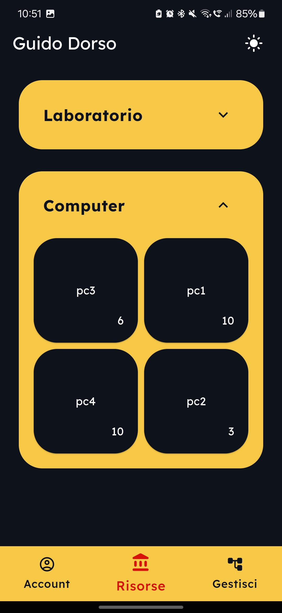
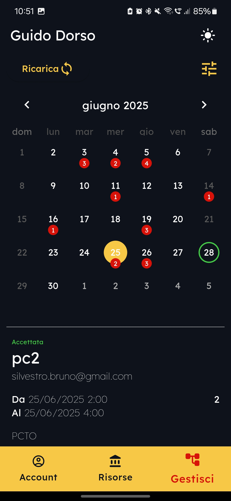
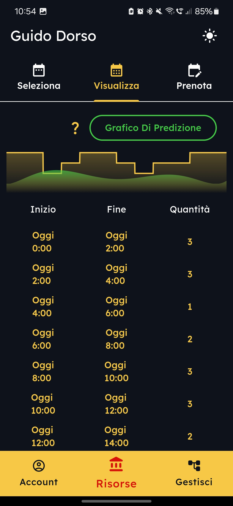
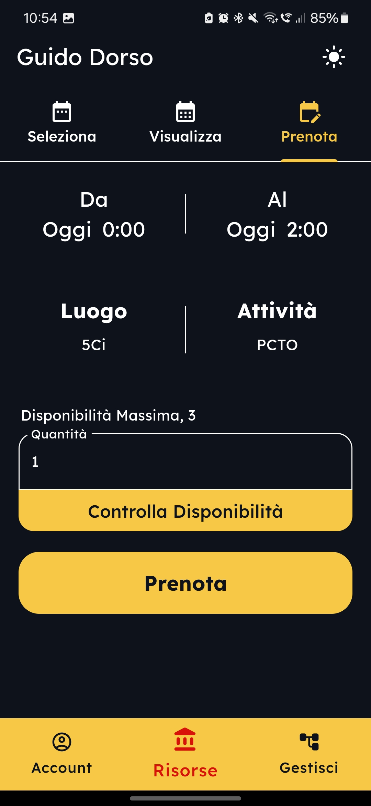

# School Scheduler

**School Scheduler** è un progetto open source per gestire le attività e le risorse di un istituto scolastico. Il repository contiene due componenti principali:

- **server**: backend sviluppato in Python con Flask e database MySQL. Gestisce utenti, ruoli, disponibilità delle risorse e invio di notifiche via email.
- **client**: applicazione Flutter che fornisce l'interfaccia utente per dispositivi mobili e Web.

## Caratteristiche principali

- Gestione di utenti, ruoli e risorse scolastiche.
- Prenotazione e pianificazione con promemoria via email.
- Previsioni sull'utilizzo delle risorse.
- Supporto multilingua (italiano e inglese).

## Pagine principali

| Screenshot | Descrizione |
|------------|-------------|
|  |  |
| Pagina account.                            | Visualizzazione risorse prenotabili.       |
|  |  |
| Pagina di gestione.                        | Calendario interattivo<br>delle prenotazioni. |
|  |  |
| Pagine per le prenotazioni 1.              | Pagina per le prenotazioni 2.              |

## Requisiti

- Python 3.12 o superiore
- MySQL
- Flutter SDK

## Installazione

1. Clona il repository:
   ```bash
   git clone <url del repository>
   cd School-Scheduler
   ```
2. **Server**
   ```bash
   cd server
   python3 -m venv .venv
   source .venv/bin/activate
   pip install flask mysql-connector-python bcrypt pytz matplotlib
   python app.py
   ```
3. **Client**
   ```bash
   cd client
   flutter pub get
   flutter run
   ```

## Struttura del progetto

```
School-Scheduler/
├─ client/  # applicazione Flutter
|   └─ lib/ # contenuto applicazione
|       └─ pages/ # codice delle pagine dell'applicazione
└─ server/  # backend Flask
```

Il client contiene un README aggiuntivo con maggiori dettagli sull'applicazione Flutter.

## Come contribuire

1. Effettua il fork del repository e crea un branch per le tue modifiche.
2. Implementa il cambiamento seguendo le linee guida del progetto.
3. Invia una pull request descrivendo il tuo contributo.
